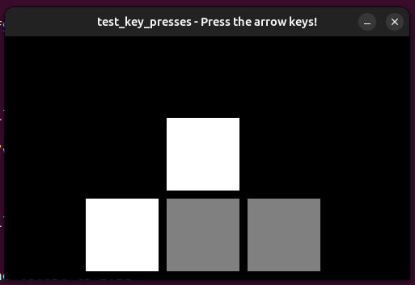
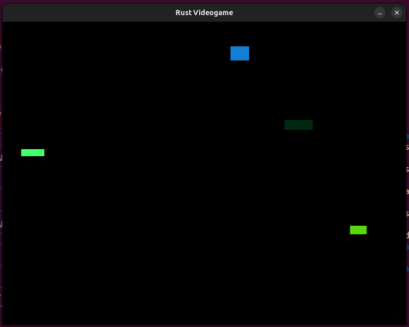
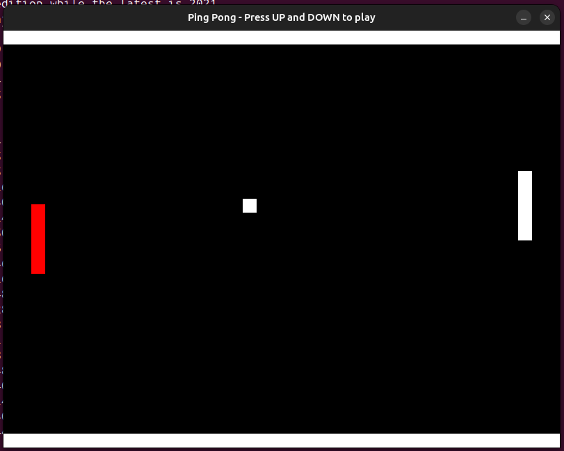

# Building a Game Engine with Rust from the Ground Up

## Running the Tests

Change the directory:

```
cd starter
```

Run the tests with the following command:

```
make test-rust
```



## Running the Videogame

Run the videogame with the following command:

```
make run-videogame
```



## Running Ping Pong

Run Ping Pong with the following command:

```
make run-pingpong
```


